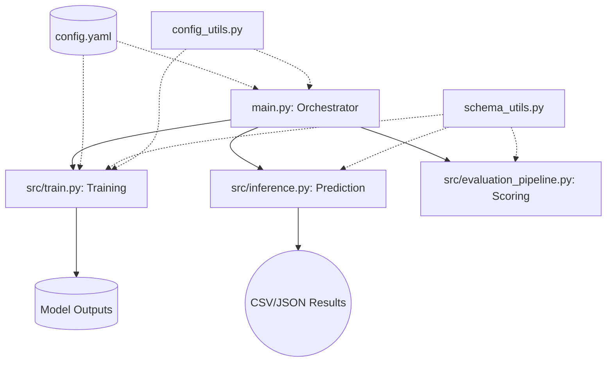

# SLM Text-to-SQL Guidebook: From Zero to Fine-Tuned Expert

**Version**: 0.1.0  
**Last Updated**: February 12, 2026  
**Project**: Small Language Model (SLM) Fine-Tuning Pipeline

---

## 📑 Table of Contents
1. [Quick Start Guide](#quick-start-guide)
2. [Reading Guide](#reading-guide)
3. [Glossary](#glossary)
4. [Chapter 1: Introduction & Overview](#chapter-1-introduction-overview)
5. [Chapter 2: Getting Started](#chapter-2-getting-started)
6. [Chapter 3: Architecture Deep Dive](#chapter-3-architecture-deep-dive)
7. [Chapter 4: Core Concepts](#chapter-4-core-concepts)
8. [Chapter 5: Codebase Walkthrough](#chapter-5-codebase-walkthrough)
9. [Chapter 6: Data Management](#chapter-6-data-management)
10. [Chapter 7: APIs & Integrations](#chapter-7-apis-integrations)
11. [Chapter 8: Business Logic](#chapter-8-business-logic)
12. [Chapter 9: Testing](#chapter-9-testing)
13. [Chapter 10: Troubleshooting](#chapter-10-troubleshooting)
14. [Chapter 11: Best Practices & Conventions](#chapter-11-best-practices-conventions)
15. [Appendices](#appendices)

---

## ⚡ Quick Start Guide
*⏱️ 5 minutes*

Welcome! If you want to see the pipeline in action immediately, follow these three steps:

1. **Sync Environments**:
   ```bash
   uv sync
   ```
2. **Train the Model**:
   ```bash
   python main.py train --epochs 1
   ```
3. **Inference**:
   ```bash
   python main.py inference --inference_data data/test_sft.jsonl
   ```

4. **Batch Mode (All-in-one)**:
   ```bash
   python main.py --config config.yaml all
   ```

> [!TIP]
> This pipeline is optimized for **Unsloth**, which makes fine-tuning up to 2x faster and uses 70% less memory.

---

## 📖 Reading Guide
*How to use this document based on your experience:*

| Audience            | Strategy                             | Recommended Chapters |
| :------------------ | :----------------------------------- | :------------------- |
| **Beginners**       | Focus on "why" and analogies.        | Ch 1, 2, 4, 12       |
| **Developers**      | Code flow and integration.           | Ch 3, 5, 7, 10       |
| **Data Scientists** | Hyperparameters and data formatting. | Ch 4, 6, 9           |

---

## 📚 Glossary
- **SLM**: Small Language Model (usually < 7B parameters).
- **SFT**: Supervised Fine-Tuning.
- **LoRA**: Low-Rank Adaptation (efficient fine-tuning).
- **Text-to-SQL**: The task of converting natural language to database queries.
- **PEFT**: Parameter-Efficient Fine-Tuning.

---

## CHAPTER 1: Introduction & Overview
*⏱️ 10 minutes*

### What this project does
In simple terms, this project teaches a small AI model how to speak "Database." It takes a natural language question (like "Which students got an A?") and converts it into a structured SQL query that a computer can run.

### Real-world problem it solves
Managing databases usually requires specialized SQL knowledge. This pipeline enables the creation of "Natural Language Interfaces" for databases, allowing anyone to talk to their data without writing a single line of code.

### Key Capabilities
- **Effortless Fine-Tuning**: Uses Unsloth for ultra-fast training.
- **Schema Awareness**: Automatically injects database context into prompts.
- **Orchestrated Flow**: A single command (`main.py`) manages the whole lifecycle.
- **Cloud Ready**: Compatible with AWS SageMaker for heavy lifting.

### Technology Stack
- **Python**: The core programming language.
- **Unsloth**: An optimization layer for Hugging Face models.
- **PyTorch**: The underlying deep learning framework.
- **Transformers/TRL**: Industry-standard libraries for model handling and training.

### Architecture Overview
The system follows a modular design where a central **Orchestrator** (`main.py`) manages various specialized scripts in the `src/` directory.



> [!NOTE]
> 💡 **Analogy**: Think of `main.py` as a **Factory Manager**. It doesn't build the parts itself, but it gives orders to the specialized workers (`train.py`, `inference.py`) and ensures they have the right tools to finish the job.

---

## CHAPTER 2: Getting Started
*⏱️ 20 minutes*

### Prerequisites
Before you begin, ensure you have the following installed. Here's why each is needed:
- **Python 3.10+**: The language that powers the entire logic.
- **CUDA-compatible GPU**: Essential for fast training. While CPUs work, they are too slow for deep learning.
- **uv**: A modern Python package manager that handles dependencies faster than standard `pip`.

### Installation
1. **Clone the project**:
   ```bash
   git clone <repository-url>
   cd SLM
   ```
2. **Install dependencies**:
   ```bash
   uv sync
   ```
   *This command reads the `pyproject.toml` and creates a virtual environment for you automatically.*

### Configuration
The project uses `pyproject.toml` to manage settings. You can find default model names and data paths there.

### Running your first instance
Start by training a small model on the sample data provided in the `data/` folder:
```bash
python main.py train --epochs 2 --model_path outputs/my-first-model
```

---

## CHAPTER 3: Architecture Deep Dive
*⏱️ 25 minutes*

### Modular Design
The SLM pipeline is built on the principle of **Separation of Concerns**. Instead of one giant file, we have small, specialized scripts.

### Folder Structure
| Directory/File        | Purpose                                     |
| :-------------------- | :------------------------------------------ |
| `main.py`             | The main entry point (CLI).                 |
| `config.yaml`         | **[NEW]** Universal configuration file.     |
| `src/config_utils.py` | **[NEW]** Utility for YAML config handling. |
| `src/train.py`        | Logic for scalable fine-tuning.             |
| `src/inference.py`    | Logic for making predictions.               |
| `src/schema_utils.py` | Utility functions for schema parsing.       |
| `data/`               | Stores datasets (JSONL format).             |
| `outputs/`            | Where trained models and results are saved. |

### Design Patterns
1. **Orchestrator Pattern**: `main.py` acts as a central hub, dispatching tasks to sub-modules. This makes the CLI easy to use while keeping logic separate.
2. **Strategy Pattern (Implicit)**: By allowing different base models (Qwen, Llama, etc.) via CLI arguments, the system can change its "learning strategy" without code changes.

---

## CHAPTER 4: Core Concepts
*⏱️ 15 minutes*

### 1. Fine-Tuning (SFT)
Fine-tuning is the process of taking a pre-trained model (like Qwen) and giving it extra training on a specific task (Text-to-SQL).

### 2. LoRA (Low-Rank Adaptation)
💡 **Analogy**: Imagine you have a giant 1000-page encyclopedia. Instead of rewriting the whole book to add a new chapter, you just add a few sticky notes (LoRA layers) that contain the new information. This is much faster and saves space!

### 3. Schema Injection
Models don't know your database by heart. We must "inject" the schema (tables and columns) into the prompt so the model knows which tables exist.
- **Keyword Matching**: We look for words in the user's question that match table names.
- **Foreign Key Expansion**: We include related tables to ensure the model can perform JOINs correctly.

> [!CAUTION]
> If you don't include the schema, the model might "hallucinate" table names that don't exist!

---

## CHAPTER 5: Codebase Walkthrough
*⏱️ 45 minutes*

This is the main educational section. We will walk through the core files that make the magic happen.

### 1. `main.py`: The Orchestrator
**Purpose**: The Command Line Interface (CLI) that simplifies complex tasks into single commands.

**Key Code Snippet**:
```python
def main():
    # ... parser setup ...
    if args.stage == "train":
        run_train(args)
    elif args.stage == "evaluate":
        run_evaluate(args)
    # ...
```
- **Unified Configuration**: Now supports a `--config` flag to load all settings from a YAML file.
- **Beginner Note**: Think of this as the **Command Center** for your AI factory.

### 2. `src/train.py`: The Teacher
**Purpose**: Orchestrates the fine-tuning process using Unsloth.

**Code Flow**:
1. **Load Config**: Reads settings from `config.yaml` using `config_utils.py`.
2. **Load Model**: Uses `FastLanguageModel.from_pretrained`.
3. **Format Data**: Scalably handles JSONL using ChatML and model-specific templates.
4. **Train**: Starts the `SFTTrainer`.

### 3. `src/schema_utils.py`: The Librarian
**Purpose**: Manages database knowledge and builds the final prompts.

**Important Functions**:
- `find_relevant_tables`: Recommends tables based on the user's question.
- `expand_with_foreign_keys`: Ensures joinable tables are included.
- `build_sft_prompt`: The master function that puts everything together.

---

## CHAPTER 6: Database & Data Management
*⏱️ 15 minutes*

### The JSONL Format
We use `.jsonl` (JSON Lines) because it is scalable. Each line is an independent JSON object, allowing us to stream massive datasets without loading them entirely into memory.

**Example Entry**:
```json
{"instruction": "Show all students", "output": "SELECT * FROM students"}
```

### Table Schema (`tables.json`)
The `tables.json` file contains the "blueprints" of your databases. It defines:
- **Table Names**: `students`, `courses`, etc.
- **Column Names**: `id`, `name`, `age`.
- **Foreign Keys**: Links between tables (e.g., `student_id` links to the `students` table).

---

## CHAPTER 7: APIs & Integrations
*⏱️ 10 minutes*

### AWS SageMaker
While this pipeline runs locally, it is "Cloud-Ready." 

**Cloud Logic**:
In `src/train.py`, we check for environment variables like `SM_MODEL_DIR`. If they exist, the script knows it's running on AWS and saves the model to the special cloud directory.

```python
sm_model_dir = os.environ.get("SM_MODEL_DIR")
default_output = sm_model_dir if sm_model_dir else "outputs/qwen-text2sql"
```

> [!TIP]
> **Advanced Tip**: Using SageMaker Spot Instances can save you up to 70% on training costs!

---

## CHAPTER 8: Frontend/UI Components
*⏱️ 2 minutes*

> [!NOTE]
> **Not Applicable**: This project is currently a backend-focused CLI (Command Line Interface) tool. The "Interface" is the terminal where you run commands and view logs.

---

## CHAPTER 9: Business Logic
*⏱️ 20 minutes*

The "Business Logic" of this project is the translation of human intent into precise database commands.

### Core Rules
- **Schema-First**: No query is generated without first consulting the database schema.
- **Join Safety**: If two tables are needed, the system automatically looks for the Foreign Key that connects them.
- **Normalization**: The model is taught to output standard SQL-92 compatible queries.

### Workflow Example: "Who is the teacher of Course X?"
1. **Identify Tables**: The system finds `Teachers` and `Courses`.
2. **Find Connection**: It identifies that `Teachers.id` maps to `Courses.teacher_id`.
3. **Draft SQL**: `SELECT T.name FROM Teachers T JOIN Courses C ON T.id = C.teacher_id WHERE C.name = 'Course X'`.

---

## CHAPTER 10: Testing & Quality
*⏱️ 15 minutes*

### 1. Execution Accuracy
We don't just check if the SQL looks right; we check if it **runs**.
- **Gold SQL**: The correct query written by a human.
- **Predicted SQL**: The query generated by the AI.
- **Test**: Both are run on a real database. If the results (the data returned) match, the test passes!

### 2. The Evaluation Pipeline
Running `python main.py evaluate` triggers a full sweep of your test dataset and provides a final accuracy score (e.g., 85%).

---

## CHAPTER 11: Deployment & DevOps
*⏱️ 10 minutes*

### Development Environment
The use of `uv` ensures that "it works on my machine" also means "it works on your machine."

### CI/CD Conceptual Flow
1. **Commit Code**: Push your changes to Git.
2. **Automated Training**: A GitHub Action or Jenkins job triggers the SageMaker script.
3. **Model Registry**: The final model is saved to S3 or Hugging Face.

---

## CHAPTER 12: Common Tasks & Workflows
*⏱️ 15 minutes*

### How to add a new feature
1. **Modify `src/`**: Add your logic in a new file or modify an existing one.
2. **Update `main.py`**: Add a new sub-parser and link it to your logic.
3. **Test locally**: Run `python main.py <your-new-stage>`.

### How to fix a SQL hallucination
1. **Check the prompt**: Use `inference.py` with logging enabled to see the prompt sent to the model.
2. **Adjust `schema_utils.py`**: If a table was missing, improve the keyword matching logic.
3. **Retrain**: If the model still fails, you may need more diverse training data in your JSONL file.

---

## CHAPTER 13: Troubleshooting Guide
*⏱️ 15 minutes*

### 1. "CUDA Out of Memory"
**Cause**: Training is trying to use more GPU memory than you have.
**Solution**: 
- Reduce `batch_size` in `main.py` (e.g., from 4 to 2).
- Use `load_in_4bit=True` (Unsloth handles this by default).

### 2. "Model generates empty results"
**Cause**: The prompt is missing the "SQL:" trigger word or the schema.
**Solution**: Verify that `schema_utils.py` is correctly finding tables for the given question.

---

## CHAPTER 14: Best Practices & Conventions
*⏱️ 10 minutes*

- **Descriptive Naming**: Use `student_id` instead of `sid`.
- **ChatML Template**: Always use the ChatML template to ensure consistent behavior across different models.
- **Data Privacy**: Never include real PII (Personally Identifiable Information) in your `jsonl` training data. Use synthetic data!

---

## CHAPTER 15: Future Roadmap & Contributing
*⏱️ 10 minutes*

### Planned Features
- **Multi-Turn Chat**: Support for follow-up questions (e.g., "Now show only the oldest ones").
- **DPO Alignment**: Use Direct Preference Optimization to make the model even more accurate.

### How to contribute
1. Fork the repo.
2. Create a feature branch.
3. Submit a Pull Request with passing evaluation tests.

---

## Appendices

### Appendix A: Command Cheatsheet
| Task           | Command                                                     |
| :------------- | :---------------------------------------------------------- |
| **Train**      | `python main.py train --epochs 3`                           |
| **Test**       | `python main.py inference --inference_data data/test.jsonl` |
| **Score**      | `python main.py evaluate`                                   |
| **Config Run** | `python main.py --config my_config.yaml all`                |

### Appendix B: External Resources
- [Unsloth Documentation](https://github.com/unslothai/unsloth)
- [Spider Dataset](https://yale-lily.github.io/spider)
- [Hugging Face Models](https://huggingface.co/models)

---

## 🏁 Final Words
Congratulations! You've reached the end of the SLM Guidebook. Whether you're a student or a pro, you now have the tools to build world-class Text-to-SQL pipelines. **Happy Fine-Tuning!**
