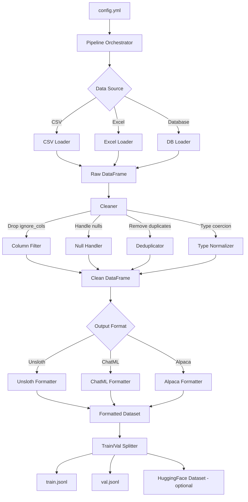

# Tabular Dataset → SFT Production Pipeline Plan

## Overview

Transform the existing [`data_ingestion.py`](generalize_sft_slm/dataset_preprocessing/tabular_dataset/data_ingestion.py) prototype into a **production-ready, config-driven pipeline** that ingests tabular data from multiple sources (CSV, Excel, Database), cleans/preprocesses it, formats it into multiple SFT conversation formats, splits into train/val, and outputs JSONL or HuggingFace Datasets.

---

## Current State Analysis

### What exists in [`data_ingestion.py`](generalize_sft_slm/dataset_preprocessing/tabular_dataset/data_ingestion.py)

| Component | Status | Issues |
|-----------|--------|--------|
| [`TabularDataset`](generalize_sft_slm/dataset_preprocessing/tabular_dataset/data_ingestion.py:17) dataclass | ✅ Basic | No validation, no optional fields |
| [`ProcessDatabase`](generalize_sft_slm/dataset_preprocessing/tabular_dataset/data_ingestion.py:23) | ✅ Works | SQL injection risk, no connection pooling, no retry logic |
| [`ProcessLocalFile`](generalize_sft_slm/dataset_preprocessing/tabular_dataset/data_ingestion.py:60) | ✅ Works | No data cleaning, `ignore_cols` never applied, no Parquet/JSON support |
| [`_format_for_unsloth()`](generalize_sft_slm/dataset_preprocessing/tabular_dataset/data_ingestion.py:78) | ✅ Works | Only one format, hardcoded prompt, unused `isnt` variable, `ignore_cols` bug on line 85 |
| Config | ❌ Missing | Hardcoded paths, no YAML config |
| Data cleaning | ❌ Missing | No null handling, no type inference, no dedup |
| Train/val split | ❌ Missing | No splitting logic |
| Multiple output formats | ❌ Missing | Only Unsloth conversations |
| Error handling | ⚠️ Basic | Generic exceptions, no structured logging |
| Tests | ❌ Missing | Only a manual test script |

### Key Bugs in Current Code

1. **Line 85**: `col not in self.target_col` does substring check on string, not list membership — e.g., if `target_col="Survived"`, column `"S"` would be excluded
2. **Line 79**: `isnt` variable defined but never used
3. **`ignore_cols` never applied** in [`ProcessLocalFile`](generalize_sft_slm/dataset_preprocessing/tabular_dataset/data_ingestion.py:60) — columns listed in `ignore_cols` are never dropped from the DataFrame
4. **SQL injection**: f-string table name in [`ingest_database()`](generalize_sft_slm/dataset_preprocessing/tabular_dataset/data_ingestion.py:31) line 37

---

## Target Architecture



---

## Module Structure

```
generalize_sft_slm/
├── __init__.py
├── config.yml                          # Pipeline configuration
├── requirements.txt
├── dataset_preprocessing/
│   ├── __init__.py                     # Public API exports
│   ├── config.py                       # Pydantic config models
│   ├── pipeline.py                     # Orchestrator: load → clean → format → split → save
│   ├── loaders/
│   │   ├── __init__.py
│   │   ├── base.py                     # Abstract BaseLoader
│   │   ├── csv_loader.py              # CSV via Polars
│   │   ├── excel_loader.py            # Excel via Pandas
│   │   └── db_loader.py              # Database via SQLAlchemy
│   ├── cleaners/
│   │   ├── __init__.py
│   │   └── tabular_cleaner.py         # Column filter, null handling, dedup, type coercion
│   ├── formatters/
│   │   ├── __init__.py
│   │   ├── base.py                     # Abstract BaseFormatter
│   │   ├── unsloth_formatter.py       # Unsloth conversations format
│   │   ├── chatml_formatter.py        # ChatML messages format
│   │   └── alpaca_formatter.py        # Alpaca instruction/input/output format
│   ├── splitters/
│   │   ├── __init__.py
│   │   └── train_val_splitter.py      # Stratified or random split
│   └── exporters/
│       ├── __init__.py
│       └── exporter.py                # JSONL, HuggingFace Dataset, Parquet output
└── tabular_dataset/                    # DEPRECATED — replaced by new modules
    ├── __init__.py
    └── data_ingestion.py              # Original file (kept for reference)
```

---

## Detailed Component Design

### 1. Config Models — [`config.py`]

Pydantic models for YAML-driven configuration:

```python
class SourceConfig:
    type: Literal["csv", "excel", "database"]
    path: str                              # file path or DB URI
    table_name: Optional[str]              # for database source
    sheet_name: Optional[str]              # for Excel

class ColumnConfig:
    target: str                            # target column name
    ignore: list[str]                      # columns to drop
    feature_override: Optional[list[str]]  # explicit feature list

class CleaningConfig:
    drop_nulls: bool = False
    fill_nulls: Optional[dict[str, Any]]   # column: fill_value
    drop_duplicates: bool = False
    strip_whitespace: bool = True

class FormattingConfig:
    format: Literal["unsloth", "chatml", "alpaca"]
    system_prompt: Optional[str]
    instruction_template: Optional[str]    # Jinja2 or f-string template

class SplitConfig:
    train_ratio: float = 0.9
    seed: int = 42
    stratify_by: Optional[str]             # column for stratified split

class ExportConfig:
    output_dir: str = "output"
    formats: list[Literal["jsonl", "huggingface", "parquet"]]

class PipelineConfig:                      # Top-level
    source: SourceConfig
    columns: ColumnConfig
    cleaning: CleaningConfig
    formatting: FormattingConfig
    split: SplitConfig
    export: ExportConfig
```

### 2. Loaders — [`loaders/`]

**Base interface:**
```python
class BaseLoader(ABC):
    def load(self, config: SourceConfig) -> pd.DataFrame
    def validate(self) -> bool
    def get_columns(self) -> list[str]
    def get_row_count(self) -> int
```

**Implementations:**
- **`CSVLoader`**: Uses Polars for fast reading, converts to Pandas
- **`ExcelLoader`**: Uses Pandas + openpyxl, supports sheet selection
- **`DBLoader`**: Uses SQLAlchemy with parameterized queries, connection pooling, retry logic

### 3. Cleaners — [`cleaners/`]

Single `TabularCleaner` class that applies a chain of operations:
1. Drop `ignore_cols`
2. Handle nulls (drop rows, fill with defaults, or forward-fill)
3. Remove duplicate rows
4. Strip whitespace from string columns
5. Validate target column exists and has no nulls

### 4. Formatters — [`formatters/`]

**Base interface:**
```python
class BaseFormatter(ABC):
    def format(self, df: pd.DataFrame, config: FormattingConfig, column_config: ColumnConfig) -> Dataset
```

**Output schemas:**

| Format | Structure |
|--------|-----------|
| **Unsloth** | `{"conversations": [{"from": "human", "content": "..."}, {"from": "assistant", "content": "..."}]}` |
| **ChatML** | `{"messages": [{"role": "system", "content": "..."}, {"role": "user", "content": "..."}, {"role": "assistant", "content": "..."}]}` |
| **Alpaca** | `{"instruction": "...", "input": "...", "output": "..."}` |

### 5. Splitter — [`splitters/`]

- Random or stratified train/val split
- Uses sklearn `train_test_split` or manual implementation
- Configurable ratio and seed

### 6. Exporter — [`exporters/`]

- **JSONL**: Write to `.jsonl` files
- **HuggingFace Dataset**: Save as HF Dataset with `save_to_disk()`
- **Parquet**: Save as `.parquet` for efficient storage

### 7. Pipeline Orchestrator — [`pipeline.py`]

```python
class TabularSFTPipeline:
    def __init__(self, config: PipelineConfig | str):
        # Accept PipelineConfig object or path to YAML file
    
    def run(self) -> dict:
        # 1. Load data
        # 2. Clean data
        # 3. Format to SFT
        # 4. Split train/val
        # 5. Export
        # Returns summary dict
    
    def run_from_yaml(cls, yaml_path: str) -> dict:
        # Class method for config-driven execution
```

---

## Sample `config.yml`

```yaml
source:
  type: csv
  path: /home/anuj/SLM/data/Titanic-Dataset.csv

columns:
  target: Survived
  ignore:
    - PassengerId
    - Name

cleaning:
  drop_nulls: false
  fill_nulls:
    Age: 0
    Cabin: "Unknown"
  drop_duplicates: true
  strip_whitespace: true

formatting:
  format: unsloth
  system_prompt: null
  instruction_template: null  # uses default

split:
  train_ratio: 0.9
  seed: 42
  stratify_by: Survived

export:
  output_dir: output
  formats:
    - jsonl
    - huggingface
```

---

## Implementation Steps

### Phase 1: Core Infrastructure
1. Create Pydantic config models in `config.py`
2. Create `BaseLoader` ABC and implement `CSVLoader`, `ExcelLoader`, `DBLoader`
3. Create `TabularCleaner` with column filtering, null handling, dedup
4. Write unit tests for loaders and cleaner

### Phase 2: Formatting and Output
5. Create `BaseFormatter` ABC and implement `UnslothFormatter`, `ChatMLFormatter`, `AlpacaFormatter`
6. Create `TrainValSplitter` with random and stratified split support
7. Create `Exporter` for JSONL, HuggingFace Dataset, and Parquet output
8. Write unit tests for formatters, splitter, and exporter

### Phase 3: Pipeline Orchestration
9. Create `TabularSFTPipeline` orchestrator that chains all components
10. Wire up YAML config loading in `config.yml`
11. Add CLI entry point or `__main__.py` for command-line usage
12. Write integration tests for the full pipeline

### Phase 4: Production Hardening
13. Add structured logging throughout all modules
14. Add input validation and meaningful error messages
15. Fix SQL injection in DB loader with parameterized queries
16. Add retry logic for database connections
17. Update `requirements.txt` with all dependencies
18. Write README.md for the module

---

## Key Design Decisions

1. **Pandas as intermediate format**: All loaders output `pd.DataFrame` — universal, well-supported, easy to manipulate. Polars used only for fast CSV reading.
2. **Pydantic for config**: Type-safe, validates at load time, good error messages.
3. **Plugin pattern for formatters**: Easy to add new SFT formats without touching existing code.
4. **Streaming not needed**: Tabular datasets are typically small enough to fit in memory. If needed later, can add generator-based streaming.
5. **Keep old code**: The existing `tabular_dataset/data_ingestion.py` stays for backward compatibility but is deprecated.
